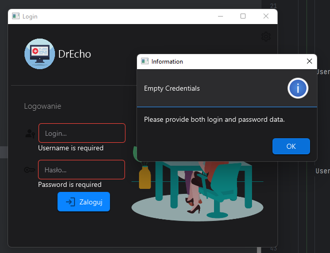
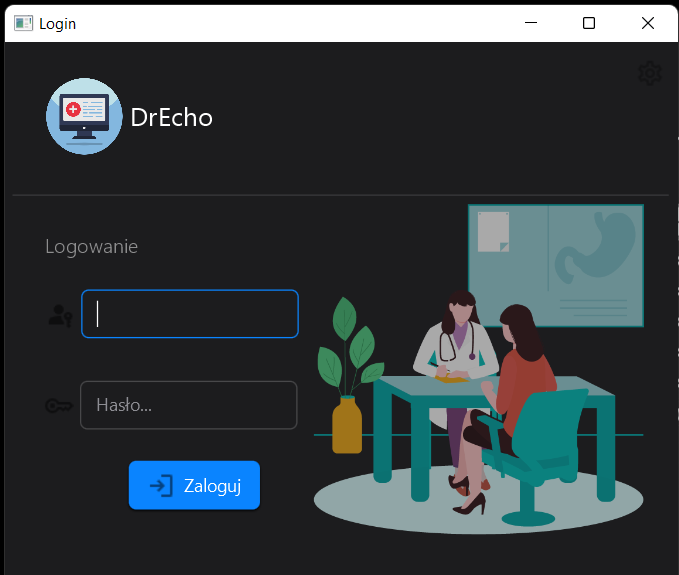
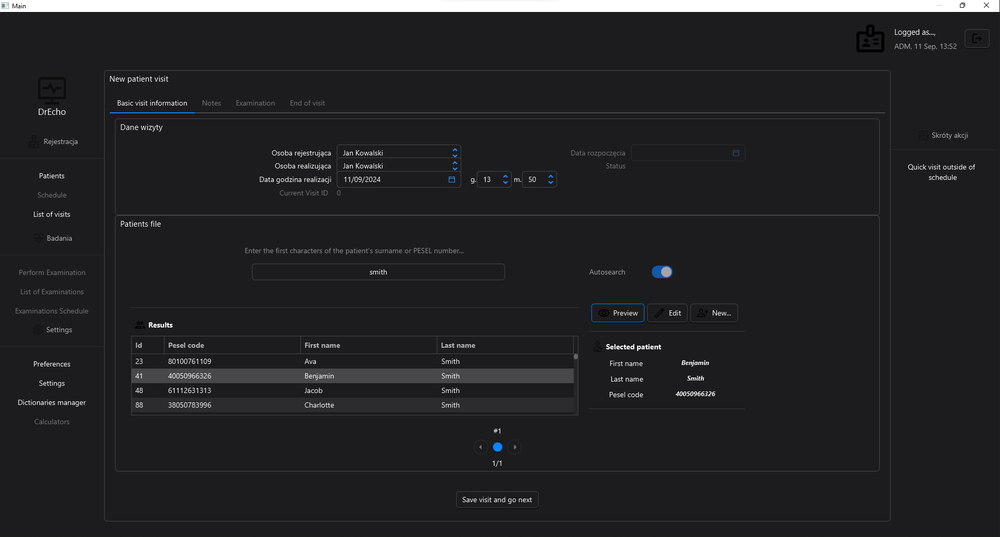
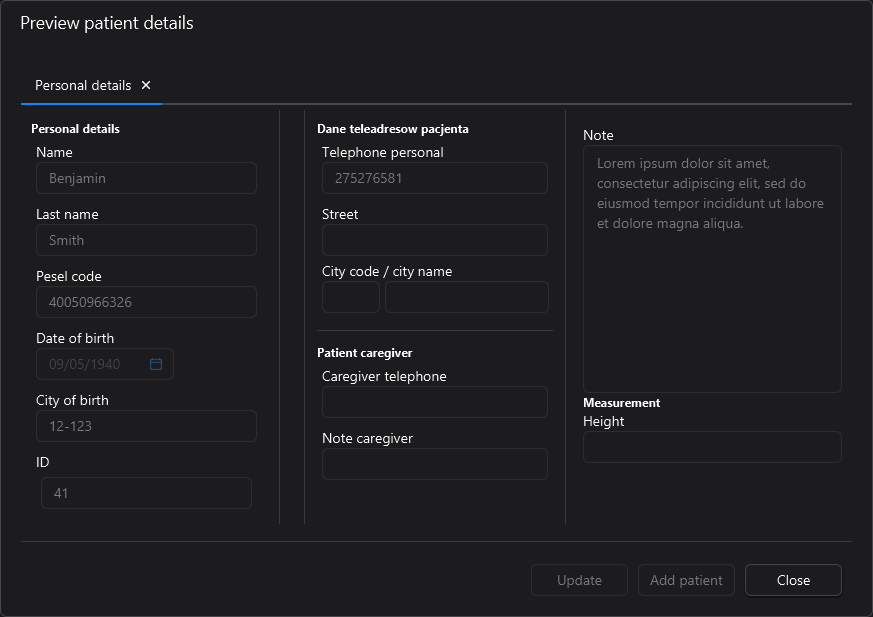
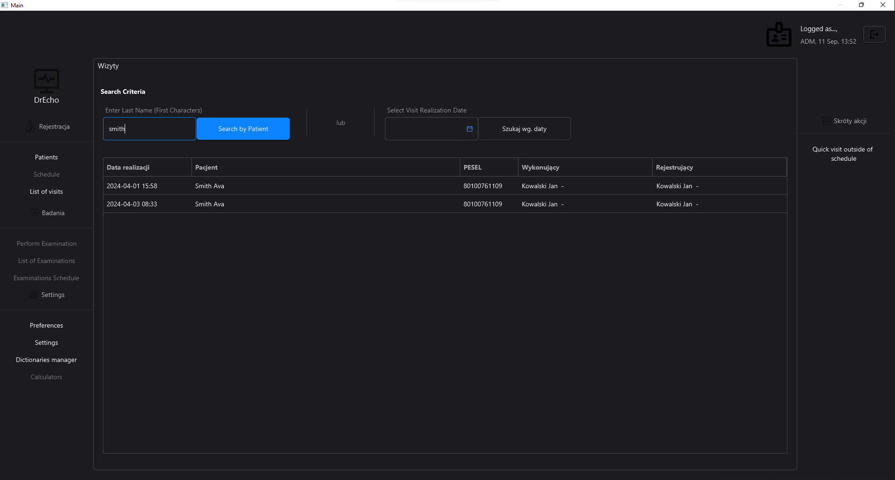
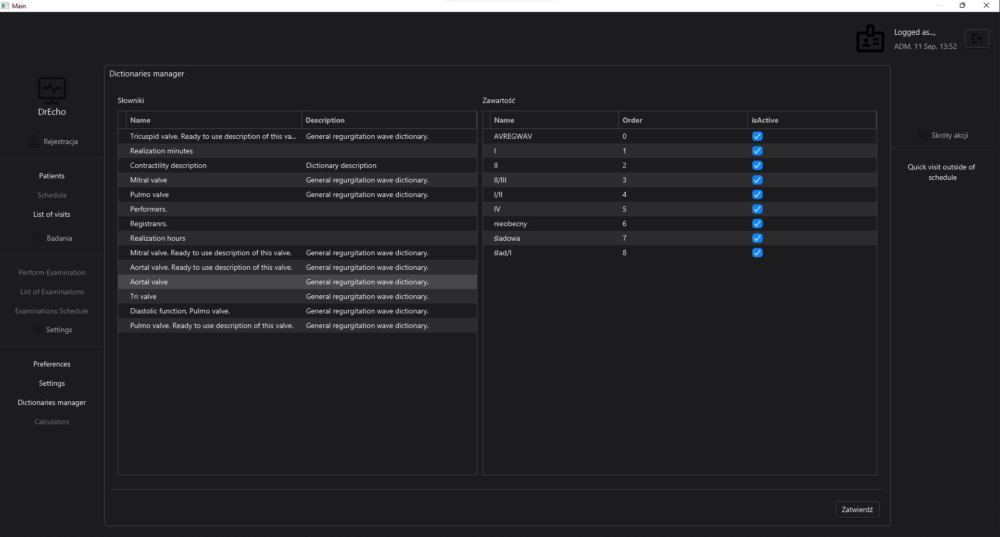
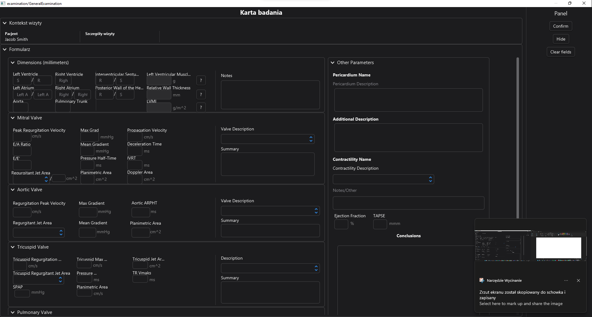
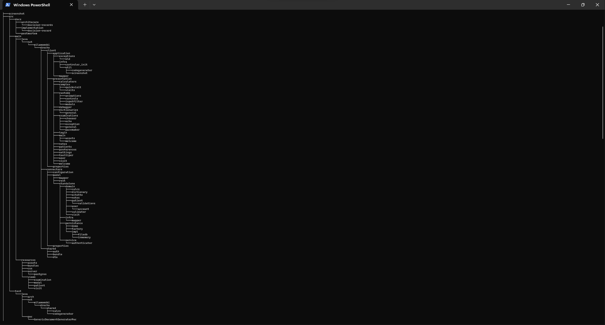

# DrEcho
## Table of Contents
- [About author](#about-me)
- [About project](#about-project)
  - [Run](#run)[Docs](#docs)

## About me
Check out my projects on:
[portfolio.wilamowski.net](https://portfolio.wilamowski.net/)

## About project
  **DrEcho** - _Your Echocardiography Record Management System_
An office system for doctors with enhanced cardiology features.
Website: [DrEcho website](https://drecho.nvl.ovh/)

**Status**
- Pet project 🐶🐱
- Status: _Under construction_

**Technical targets**
- Convenient desktop client app
  - JavaFx
  - MVVM pattern
  - Modern UI (GitHub Primer, Atlanta FX)
- Clean architecture 
  - low Coupling, high Cohesion
  - ArchUnit tests
  - DI (without annotations)
  - configurable, extensible model abstraction layer (_Connector_), implemenations:
    - demo 
    - portable / standalone
    - client-server
    - remote DB
    - REST-impl-ready
- PDFs

## Docs
Documentation for the project will be available soon.
[Documentation (Coming soon)](#docs)











    ### Run
```
 mvn clean javafx:run
```

Asserts:
```
 mvn clean javafx:run -DargLine="-ea"
```
