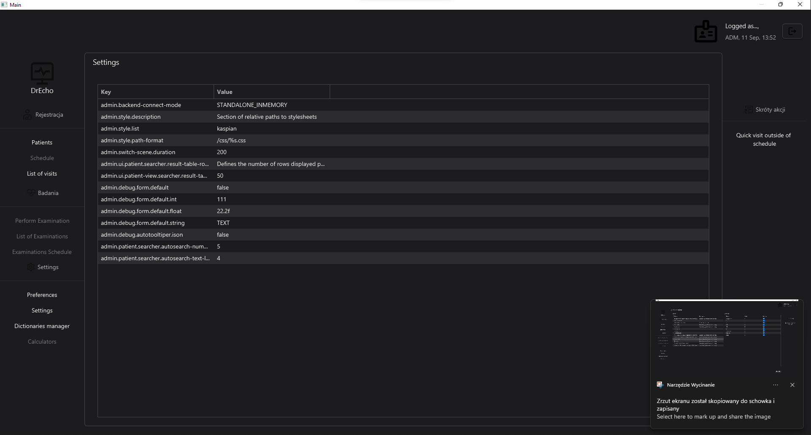

# DrEcho - Cardiology EHR System

**DrEcho** is an advanced **Electronic Health Record (EHR)** system tailored for cardiology departments. It is built with **JavaFX** and follows a loosely coupled architecture, allowing it to integrate seamlessly with different backend systems such as **standalone** or **client-server** environments.

This project serves as a sandbox for practicing clean architecture, OOP, and design patterns, inspired by the works of **Uncle Bob**, **Martin Fowler**, and my own coding challenges. It is a platform for experimenting with best practices from books, courses, and real-world experience.

## Key Features

- **Patient Registration and Management**
- **Visit Scheduling**
- **Examinations Module** with complex forms for validation and calculations
- **Customizable UI** with dark mode and focus on good user experience (UX)
- **Internationalization** support for multiple languages
- Planned Features:
  - **PDF Printer**
  - **HL7 Integration**

## Architecture & Design

- **MVVM** architecture for separation of UI and business logic
- **Loose-coupled backend connectors** for flexible integration
- **OOP**, **SOLID**, and **Clean Code** principles
- **Onion Architecture** for separating business logic and infrastructure
- **Command & Query** pattern for separating read and write operations
- **Custom Dependency Injection**

## Technical Stack

- **Frontend**: JavaFX, MVVM
- **Backend**: Oracle SQL, Docker, Shell Scripting
- **Testing**: ArchUnit, Unit Tests, InMemory Repositories
- **Design Patterns**: Factory, Builder, Dependency Injection, Command & Query

**System Architecture**

- Client Application - Modern MVVM architecture
- Data Model - Configurable and loosely coupled model layer with repository pattern
  - Standalone Model with In-Memory Demo Repository
  - Remote Database Integration [in progress]
- Report Generation Server - Utilizing JasperReports

**Self-Hosted Tools**

- Project Page https://drecho.nvl.ovh
- Issue Tracking (Redmine)
- Knowledge Base (Wiki.js)

**Status**
- Pet project 🐶🐱
- Status: _Under construction_

**Setup**
Run:
mvn clean javafx:run

Asserts:
mvn clean javafx:run -DargLine="-ea"

**Stack tags**

`#MVVM` `#OOP` `#Java` `#JavaFx` `#JasperSoft` `#PackageByFeature` `#Docker` `AtlantaFx`

## Docs
Documentation for the project will be available soon.
[Documentation (Coming soon)](#docs)

